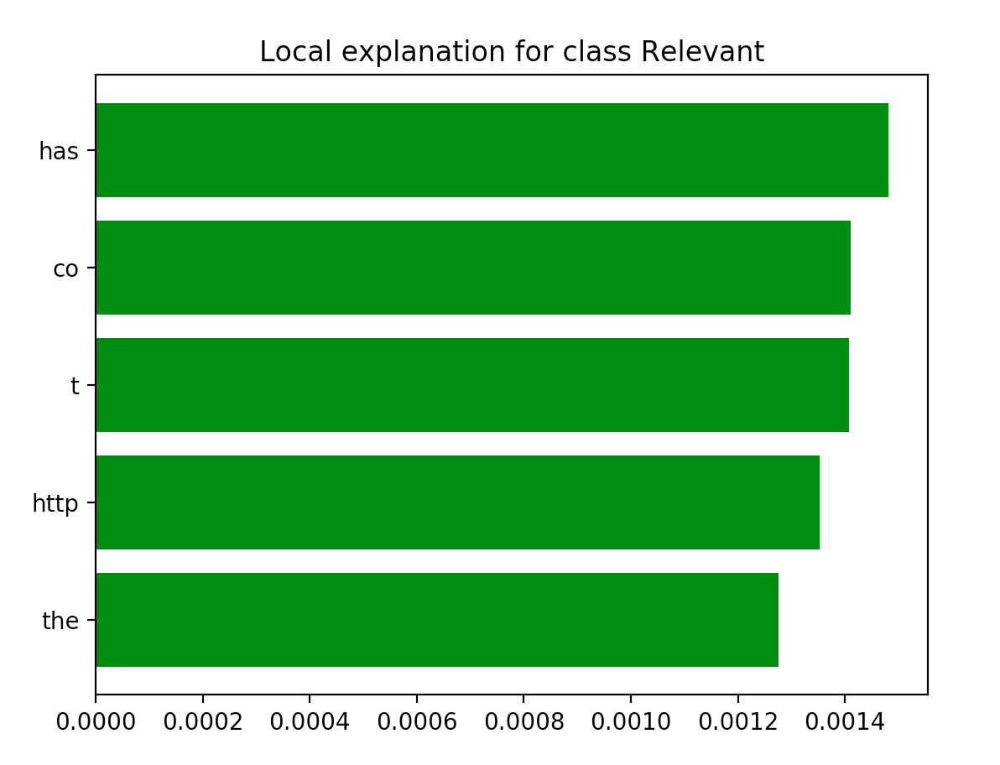

## Model
1D convolutional model with original tokenizer Tweet 7828:

`Yet another company trying to censor the Internet. Reddit has started to quarantine their content: http://t.co/pG4y3I5ciu #cc`

Model predicted 'Relevant' with probability 0.506. Here are the most important words for these prediction. You can see that model 't', 'co' and 'http' are parts of url. And by the way these words are the most often words in the vocabulary of the model. And word 'quarantine' is not important at all! 

Looks like model learns something wrong here.
