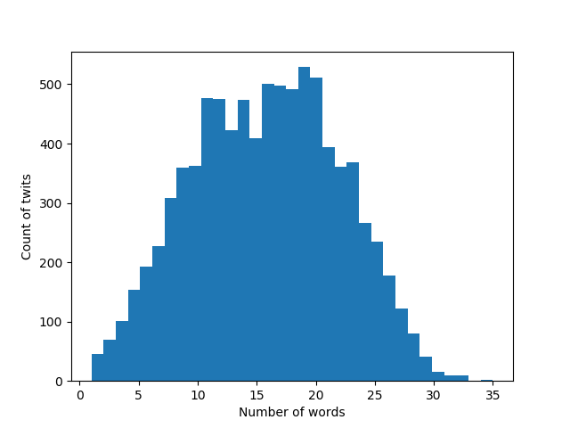
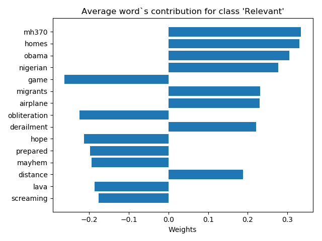
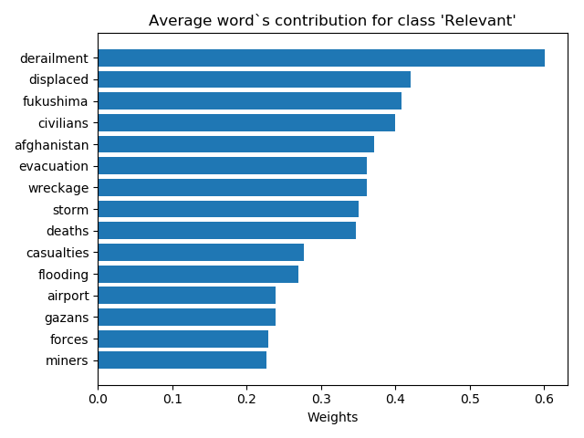
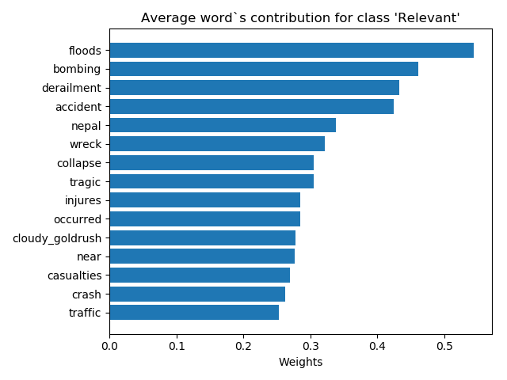

# Twitter Disaster Prediction


Lots of people are using Twitter every day. Ample amounts of text content are being created every day. But can we extract useful information from this data?

In this project I was working with dataset consisting of 10860 tweets labeled by humans as 'Relevant' or 'Not Relevant' to disasters ([CrowdFlower.com](https://www.crowdflower.com/data-for-everyone/)). Tweets were already filtered to contain keywords referring to disastrous events ('ablaze, 'quarantine', 'crash' etc.) This makes it close to a real world scenario when information was filtered by keywords and then supplied to Machine Learning algorithm for classification.

Accurate classifying algorithm could be a useful tool for civil forces to get actionable insights.

Classifying tweets is a tricky task because your model cannot rely on keywords and need to distinguish events reports from jokes and sarcasms.

## Data

10860 tweets seems to be pretty small corpus for text classification, especially given the average length of tweets.



Hashtags, emoji, links and references make twitter text data very different from any other corpus. Emoji data is absent in the dataset. Also more than half of the tweets in the dataset have some links (many of them - links to images). This means that we need to make predictions in absence of the large chunk of information contained in the original tweets.

While exploring the data I discovered few interesting things:
- Timestamps are absent, but it looks like the data was collected in a very limited period of time. I made this conclusion because I found some identical tweets and some tweets related to the same accident. For instance, there are 94(!) tweets mentioning 'MH370' accident. 10 almost identical tweets contain the same fraise 'Beyonce Is my pick for' + some links. I assume that this is a result of 2 factors:
  - Data was collected by hitting Twitter API with some keywords. If there were large event related to the keyword, it is pretty likely that a majority of returning tweets would be highly related, if not retweets.
  - Data was collected in a limited period of time.

- The data was labeled by the majority vote of at least 5 people. But I found 120 datapoint with values in 'confidence' column less than 0.5. I explored most of these tweets and come to conclusion that provided labels are correct.  

Thereby, I am working with a relatively small dataset. The data is highly likely to be skewed to the events that happened during data collection. There are identical tweets that decrease amount of useful information in the dataset. All of these are important points for consideration while evaluating the results.

## Modeling

To save specificity of twitter corpus I didn't remove '#' and '@' signs. To save semantics I separated them from the adjacent words and retain this signs as separate words. Also I replaced all the links with a code word 'http'.

#### Baseline
First, I applied simplistic approach to extracting text features - Bag of words. I vectorized tweets with TF-IDF, then applied Multinomial Naive Bayes model to make classification. Naive Bayes did surprisingly well with 80.24% accuracy on the test data. Given the specificity of the dataset and apparently wrong assumption of the model, this performance looked very suspicious.

#### Deep Learning Models
Next, I went to more sophisticated Deep Learning Models. Given small amount of data I decided to validate my DL models on the test data. First I used random trainable initialization of word embeddings, then switched to [GloVe](https://nlp.stanford.edu/projects/glove/) word vectors. I decided to use GloVe because conveniently it has vectors pre-trained on 2B tweets.

First I followed standard practices and limited vocabulary of the pre-trained embeddings (to 5000 words)  With limited vocabulary my models were able to achieve 80%+ validation accuracy, but were not able to learn anything useful and were predicting all the probabilities in vicinity of 0.5. Then I tried to use full vocabulary of 19.800 words. And it really made a difference. Accuracy increased and model started to be consisted in predictions. I think that due to the limited corpus and repeating tweets in the data, top 5000 words were not a good representation of important words for this dataset.

I tried different models and here are validation accuracies for different architectures.

Model | Validation accuracy(%)
--- | ---
trainable embeddings + 1 hidden layer NN | 80.85
trainable embeddings + 1D CNN | 81.58
GloVe embeddings + 1D CNN | 81.31
GloVe embeddings + LSTM | 81.54
GloVe embeddings + bidirectional LSTM | 81.26

We can see that different models achieved similar performance. To choose a model I used [LIME](https://github.com/marcotcr/lime) (Local Interpretable Model-agnostic Explanations). For each model I used 100 random datapoint from validation data to identify the most important words for making local prediction. Let's explore some results.

**Naive Bayes Model:**



These are 15 word with the largest average contributions for Naive Bayes Model.

Large weight of 'mh370' means that on average over explored datapoints removing 'mh370' from the tweets moved prediction to the class 'Non Relevant' by about 0.3. Large negative weight of 'game' means that removing 'game' from the tweets moved prediction to the class 'Relevant' by about 0.2.

We can clearly see that Naive Bayes mostly fitted noice.

**1 Hidden Layer NN:**



Explanations for 1 Hidden NN are much better, but still we can see terms exposing overfitting: Fukushima, Afghanistan, airport

**LSTM:**



And finally LSTM. Overfitting is still a problem (Nepal, cloudy_goldrush). But in general, explanations of LSTM are the most intelligent.

I chose LSTM as my final model and dockerized implementation of my model as API.

I need to admit that my training data was skewed and the model was not tested on unseen data. I cannot guarantee performance of the model.

1. To start dockerized API
```
docker container run -d -p 5000:5000 eugenekoran/twitter_dis_api
```
2. Example request
```
http://<host>:5000/prediction?tweet=GO LOOK AT GRIZZLY PEAK RIGHT NOW... It looks like the beginning of an dystopian apocalypse movie
```
3. Example response
```
{"prob_of_relevant": "0.14627251",
 "tweet": "GO LOOK AT GRIZZLY PEAK RIGHT NOW... It looks like the beginning of an dystopian apocalypse movie",
 "prediction": "Not Relevant"}
```

## Future work

It was exciting to work on this project. I plan to continue working on it.

Some ideas for future work:
1. Get more unlabeled data from Twitter API and use it to learn better data representation.
2. Build web-application classifying tweets in real time.
